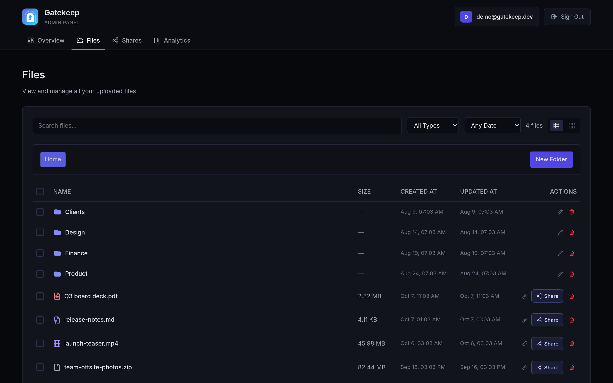
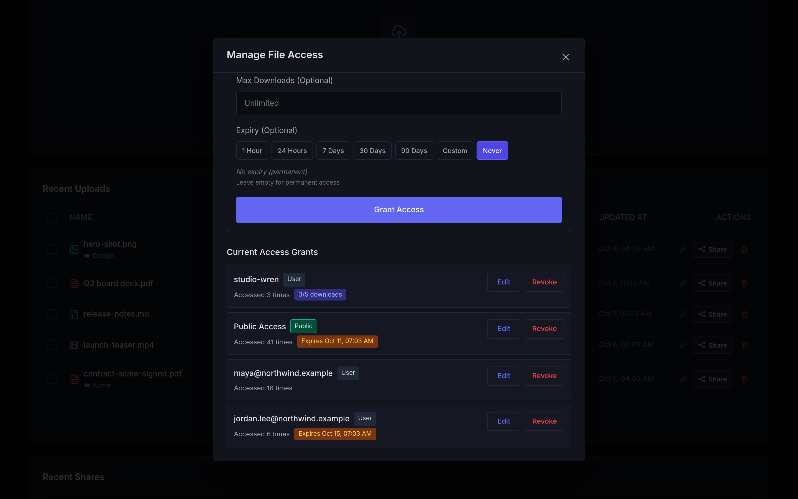
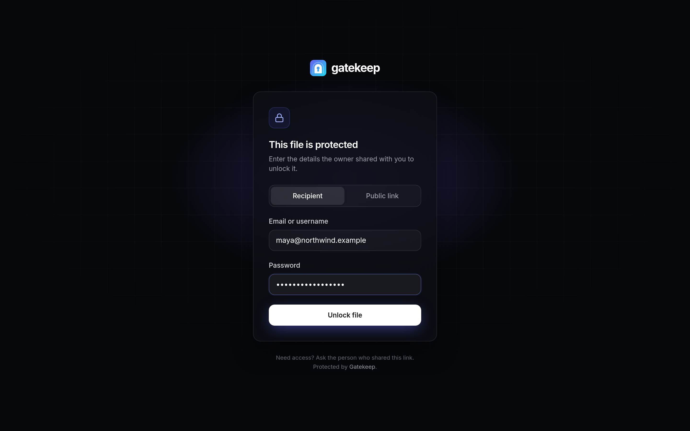
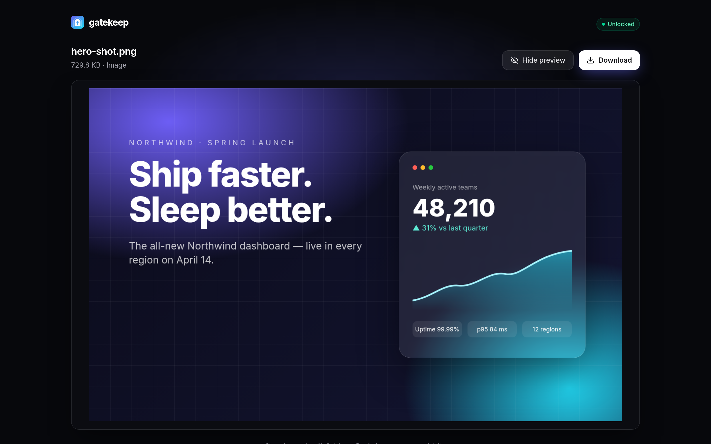
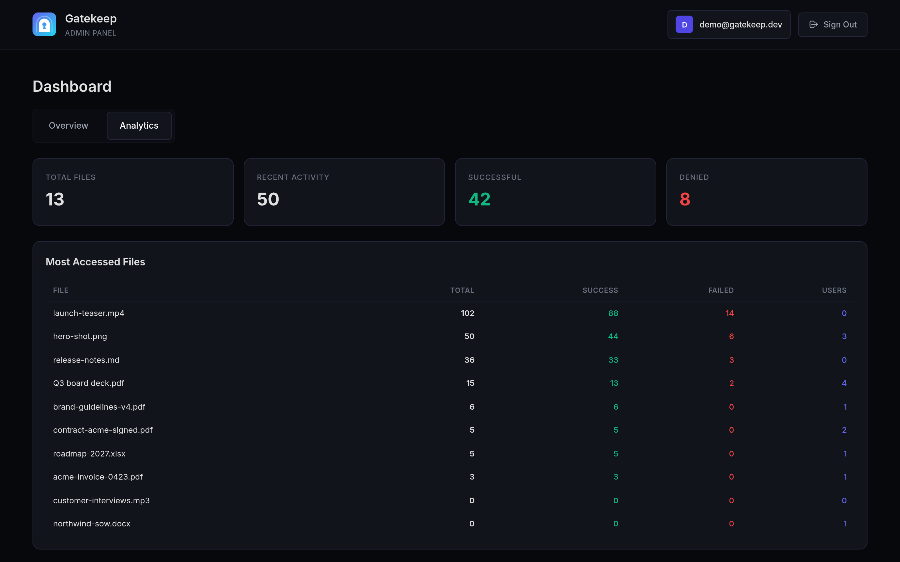
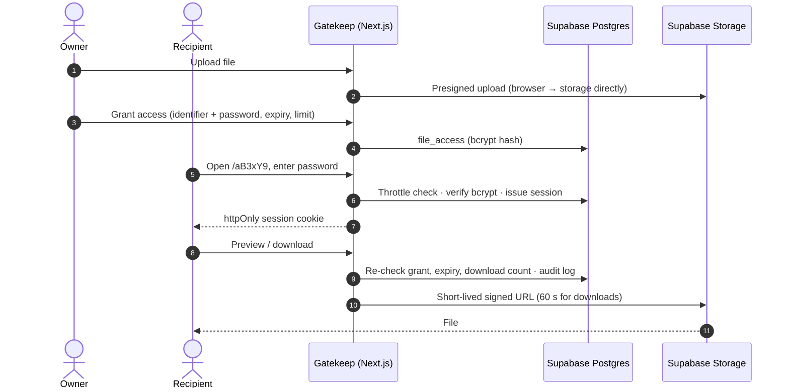

<p align="center">
  <picture>
    <source media="(prefers-color-scheme: dark)" srcset="public/brand/readme-banner-dark.png" />
    
  </picture>
</p>

<p align="center">
  <b>Self-hosted, access-controlled file sharing.</b><br />
  Upload once, send a short link, and decide exactly who can open it — and for how long.
</p>

<p align="center">
  <a href="https://github.com/omsingh02/gatekeep/actions/workflows/ci.yml"></a>
  <a href="https://github.com/omsingh02/gatekeep/releases/latest"></a>
  <a href="LICENSE"></a>
  
  
</p>

<p align="center">
  <a href="https://gatekeep.omsingh.me">Website</a> ·
  <a href="#-self-host-in-10-minutes">Self-host</a> ·
  <a href="docs/DEPLOYMENT.md">Docs</a> ·
  <a href="https://github.com/omsingh02/gatekeep/issues/new/choose">Report a bug</a> ·
  <a href="https://github.com/omsingh02/gatekeep/discussions">Discussions</a>
</p>

<p align="center">
  
</p>

## Why Gatekeep?

Public links leak, and cloud drives want every recipient to have an account. Gatekeep sits in between:
**you own the storage, every recipient gets their own password, and you can see — and revoke — every access.**
It runs on your own Supabase project and deploys to Vercel or Docker in about ten minutes.

## ✨ Features

<table>
  <tr>
    <td width="50%" valign="top">
      <h3>🔗 Short links, per-recipient passwords</h3>
      Every file gets a link like <code>/aB3xY9</code>. Grant access to an email or username with its own
      password — one at a time or in bulk — or make a public, password-only link.
    </td>
    <td width="50%" valign="top">
      <h3>⏳ Expiry, download limits, live revocation</h3>
      Grants lapse on a date and/or after <i>N</i> downloads. Revoke a named recipient and their open
      session ends immediately.
    </td>
  </tr>
  <tr>
    <td valign="top"></td>
    <td valign="top"></td>
  </tr>
  <tr>
    <td valign="top">
      <h3>👀 In-browser preview</h3>
      Recipients view images, video, audio, PDFs, text/code and Office documents without downloading first.
    </td>
    <td valign="top">
      <h3>📊 Analytics &amp; audit log</h3>
      Every view, download and denied attempt is logged — with the reason it was blocked.
    </td>
  </tr>
  <tr>
    <td valign="top"></td>
    <td valign="top"></td>
  </tr>
</table>

Also: nested folders · optional email notifications via [Resend](https://resend.com) · mobile-friendly
recipient pages · `GET /api/health` for uptime monitors · daily keep-alive so free Supabase projects never pause.

## 🚀 Self-host in 10 minutes

You need a free [Supabase](https://supabase.com) project, plus a Vercel account **or** any machine with Docker.

**1. Set up the database and your admin account**

```bash
git clone https://github.com/omsingh02/gatekeep.git && cd gatekeep
npm install
cp .env.example .env.local           # paste your Supabase URL + keys
npx supabase link --project-ref <your-project-ref>
npx supabase db push                 # tables, row-level security, private storage bucket
npm run create-admin                 # the account you sign in with
```

**2. Deploy**

| Host | How |
|---|---|
| **Vercel** (recommended) | <a href="https://vercel.com/new/clone?repository-url=https%3A%2F%2Fgithub.com%2Fomsingh02%2Fgatekeep&env=NEXT_PUBLIC_SUPABASE_URL,NEXT_PUBLIC_SUPABASE_ANON_KEY,SUPABASE_SERVICE_ROLE_KEY,NEXT_PUBLIC_APP_URL,CRON_SECRET&envDescription=Supabase%20project%20keys%2C%20your%20public%20URL%20and%20a%20random%20cron%20secret&envLink=https%3A%2F%2Fgithub.com%2Fomsingh02%2Fgatekeep%2Fblob%2Fmain%2Fdocs%2FDEPLOYMENT.md&project-name=gatekeep&repository-name=gatekeep"></a> — the keep-alive cron is preconfigured in `vercel.json`. [Guide →](docs/DEPLOYMENT.md) |
| **Docker** | `cp .env.example .env && docker compose up -d --build` — app + keep-alive sidecar. [Guide →](docs/DOCKER.md) |
| **Local** | `npm run dev` → http://localhost:3000 |

Then point an uptime monitor at `https://<your-domain>/api/health`.

## 🔐 Security

- **Row-level security** on every table; the service-role key never leaves the server.
- Recipient passwords are **bcrypt**-hashed; sessions are random tokens, stored hashed, sent as **httpOnly, SameSite=Strict** cookies.
- **Brute-force throttling** backed by the audit log — 20 failed attempts per IP and 100 per file every 15 minutes — so it holds across serverless instances.
- Files live in a **private bucket** and are only served through **short-lived signed URLs** after the grant is re-checked.
- Strict **CSP**, HSTS, `X-Frame-Options: DENY` and input sanitisation on every route.

Found a vulnerability? Please [report it privately](https://github.com/omsingh02/gatekeep/security/advisories/new) — see [SECURITY.md](SECURITY.md).

## ⚙️ How it works



More detail in [docs/ARCHITECTURE.md](docs/ARCHITECTURE.md).

## 🧱 Tech stack

| Layer | Tech |
|---|---|
| App | Next.js 16 (App Router, Route Handlers), React 19, TypeScript |
| UI | Tailwind CSS v4, lucide-react |
| Data, auth, storage | Supabase — Postgres + RLS, Auth, Storage, Realtime |
| Email | Resend (optional) |
| Quality | Vitest, ESLint, GitHub Actions (typecheck · lint · tests · build · migrations on a fresh Postgres) |

## 🛠️ Development

| Command | Description |
|---|---|
| `npm run dev` | Dev server on http://localhost:3000 |
| `npm test` | Unit tests (Vitest) |
| `npm run lint` | ESLint |
| `npm run build` / `npm start` | Production build / serve it |
| `npm run create-admin` | Create the admin user, or reset its password |
| `npm run seed:demo` / `npm run screenshots` | Seed a **local** Supabase with demo data / regenerate the README screenshots — see [docs/SCREENSHOTS.md](docs/SCREENSHOTS.md) |

Contributions are welcome — read [CONTRIBUTING.md](CONTRIBUTING.md) and the [Code of Conduct](CODE_OF_CONDUCT.md) first.

## 🗺️ Ideas

Not promises — directions we'd welcome help with: one-time email links for recipients instead of passwords,
S3-compatible storage backends, multiple admin accounts, and an end-to-end test suite.
[Start a discussion](https://github.com/omsingh02/gatekeep/discussions) if you'd like to work on one.

## 📄 License

[MIT](LICENSE) © 2026 Om Singh
