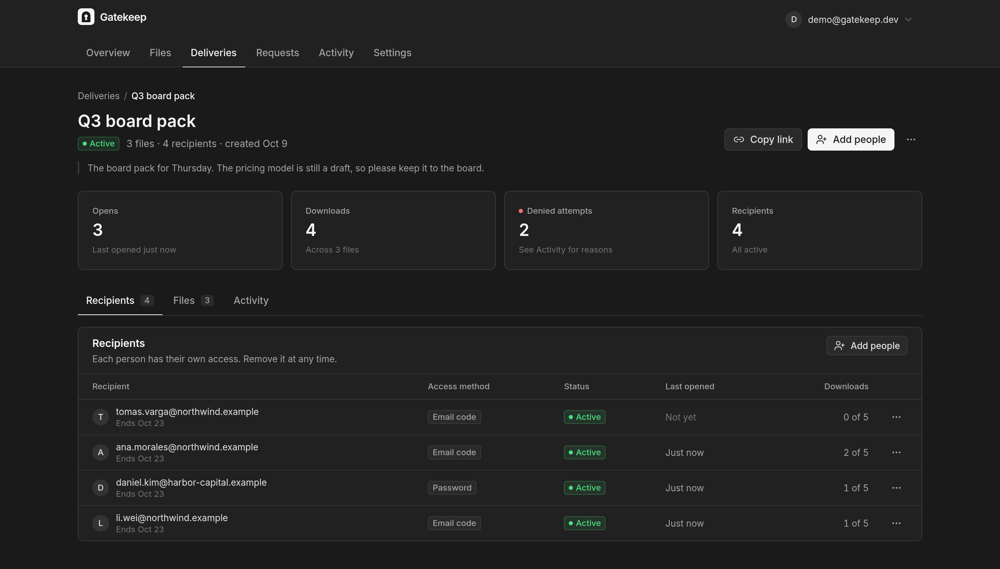
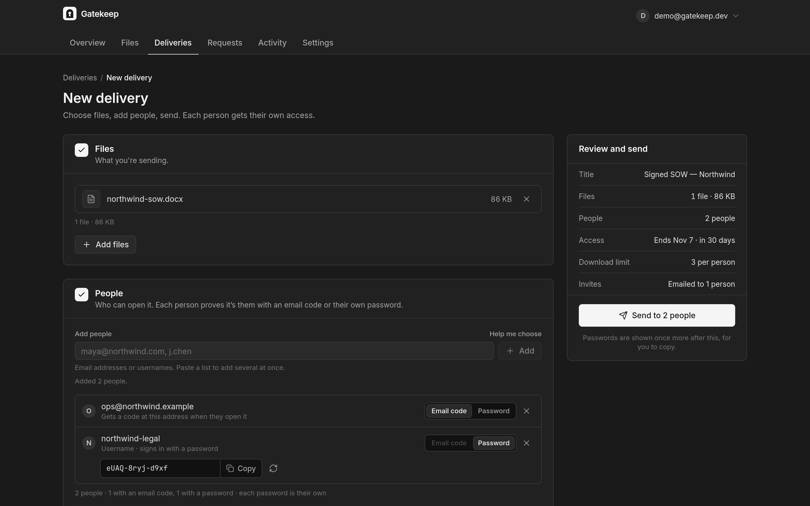
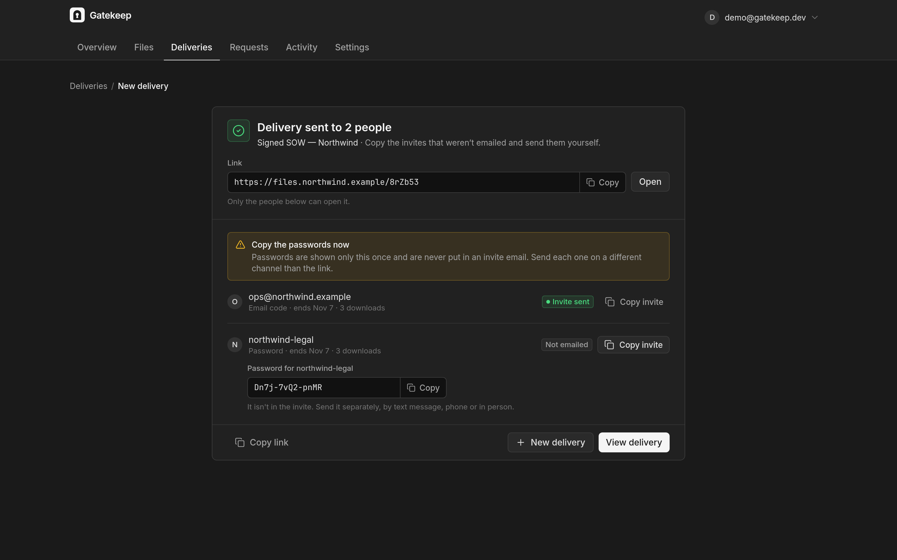
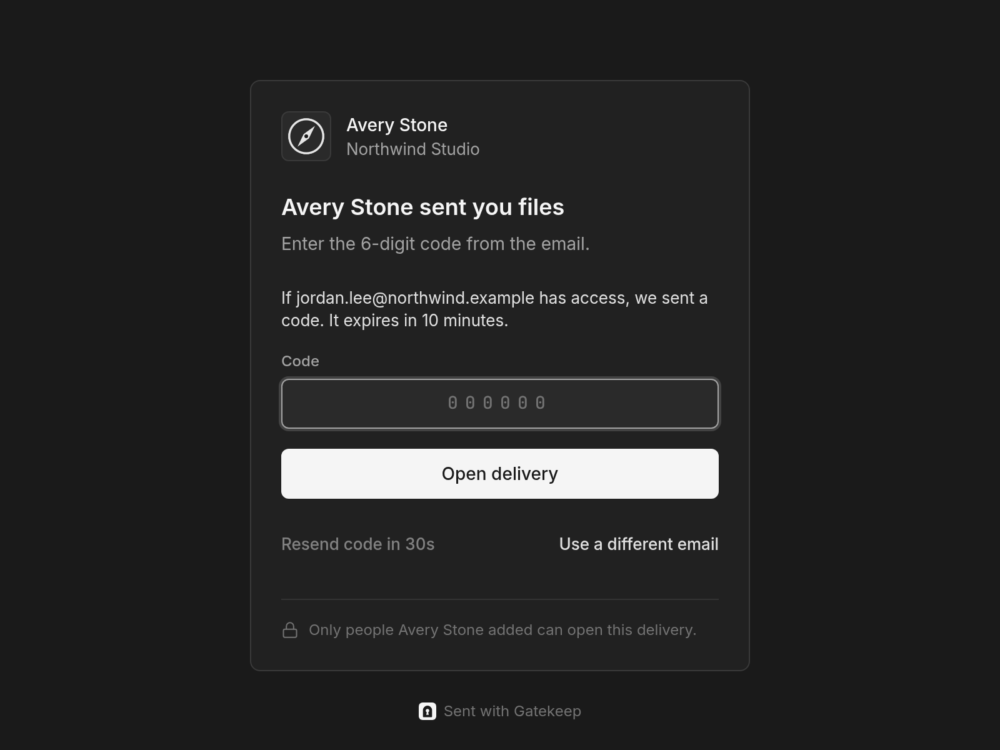
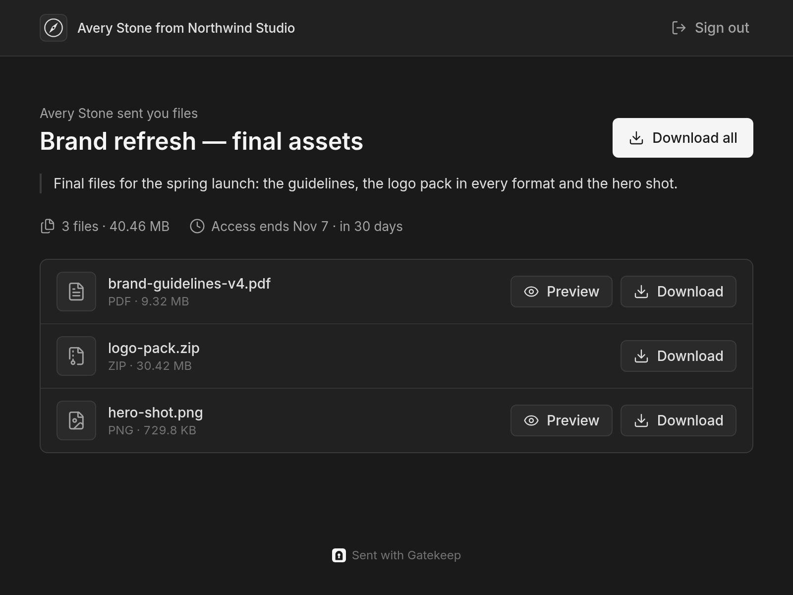
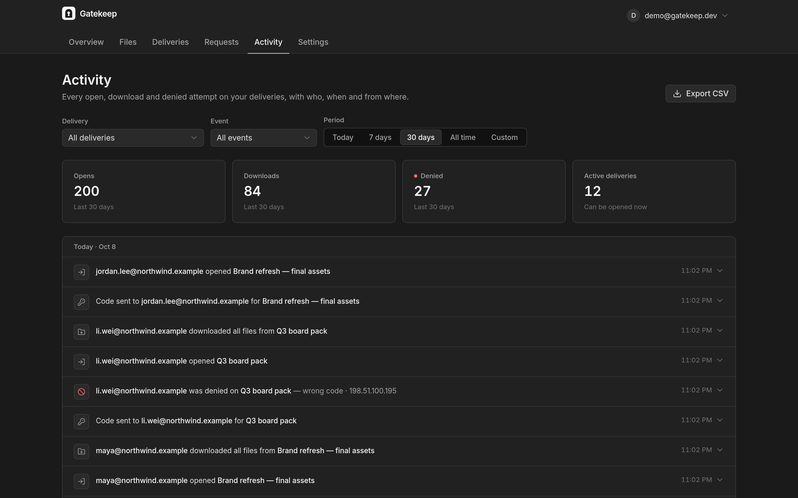
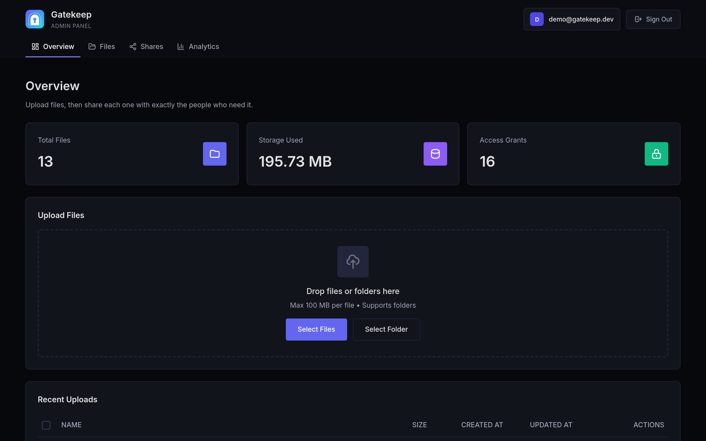
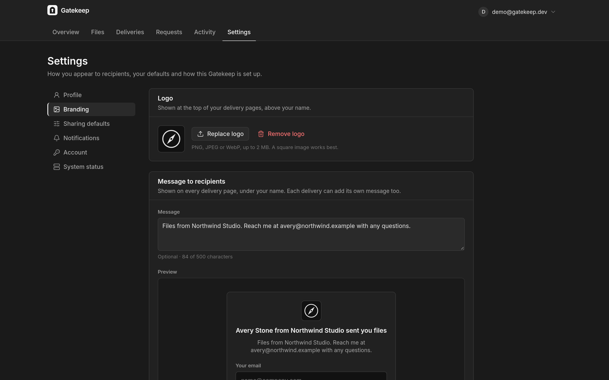
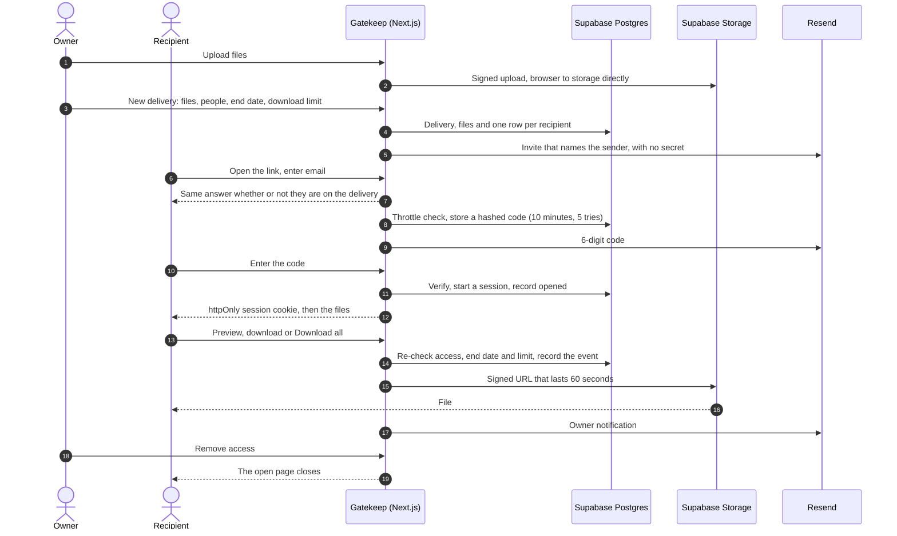

<p align="center">
  <picture>
    <source media="(prefers-color-scheme: dark)" srcset="public/brand/readme-banner-dark.png" />
    
  </picture>
</p>

<p align="center">
  <b>Send it. See who opened it. Take it back.</b><br />
  Open-source, self-hosted file delivery for people who send files that matter.
</p>

<p align="center">
  <a href="https://github.com/omsingh02/gatekeep/actions/workflows/ci.yml"></a>
  <a href="https://github.com/omsingh02/gatekeep/releases/latest"></a>
  <a href="LICENSE"></a>
</p>

<p align="center">
  <a href="https://gatekeep.omsingh.me">Website</a> ·
  <a href="#self-host-in-10-minutes">Self-host</a> ·
  <a href="docs/DEPLOYMENT.md">Docs</a> ·
  <a href="https://github.com/omsingh02/gatekeep/issues/new/choose">Report a bug</a> ·
  <a href="https://github.com/omsingh02/gatekeep/discussions">Discussions</a>
</p>

<p align="center">
  
</p>

Gatekeep is an open-source, self-hosted way to send files that matter to people outside your organization:
designs to a client, a board pack to directors, a contract to legal, payroll to HR. Every recipient gets their
own access, every open and every denied attempt is on the record, and you can take access back at any moment,
even while their page is open. It runs on your own Supabase project, on Vercel or Docker.

## Why Gatekeep

Most file-sharing links are **bearer links**: anyone holding the URL (and maybe one shared password) gets in,
and you learn nothing. Gatekeep is built around **named recipients**.

| | A typical file link | A Gatekeep delivery |
|---|---|---|
| Who can open it | Anyone with the URL | Only the people you add, each with their own email code or password |
| What you learn | A download count, if anything | Who opened, previewed, downloaded or was denied, when, from which IP, and why |
| After you send it | Delete the file and hope | End dates, download limits, and removal that closes an open page immediately |
| Where the files live | Someone else's cloud | A private bucket in your own Supabase project |

## Features

### Deliveries

One link for one or more files, sent to the people you name, with a title and a message. Choose files from your
library, add people by email (or username), and set when access ends and how many downloads each person gets.
Every email recipient gets an invite that names you and holds no secret; password recipients get their own
generated password, shown to you once to send on another channel. Need to share with a group you can't name?
Add **anyone with the password**.

<table>
  <tr>
    <td width="50%"></td>
    <td width="50%"></td>
  </tr>
</table>

### What recipients see

No account and nothing to install. The page names you (with your logo) and shows nothing else until the person
proves who they are: they enter their email and type the 6-digit code they're sent, or use their password. Then
they see the files with **Preview** (images, video, audio, PDFs, text and code) and **Download**, and
**Download all** as one zip built in the browser. If you remove their access while the page is open, it closes
on the spot.

<table>
  <tr>
    <td width="50%"></td>
    <td width="50%"></td>
  </tr>
</table>

### Receipts

**Activity** records every open, preview, download, upload and denied attempt (with the reason: wrong code,
not on this delivery, access ended, download limit reached), plus the person, time, IP address and browser.
Filter by delivery, event and period, see totals, and export CSV. Email notifications tell you when someone
opens a delivery, is repeatedly denied, uploads files or (optionally) downloads.

<p align="center"></p>

### Requests

A **request** is a link for receiving files, with the same named recipients and sign-in. People see what you
asked for, upload with progress and retries, and the files land in the folder you choose. You get one email
per batch.

### Files, settings and branding

Keep your files in folders, then send them from anywhere with **Send**. In Settings, set the name and
organization recipients see, your logo and a message for every delivery page, sharing defaults (access method,
end date, download limit), notifications, your password, and a **System status** page that checks email, the
daily job, sign-ups, storage and migrations. The homepage of your instance can be this product page or a
simple branded welcome.

<table>
  <tr>
    <td width="50%"></td>
    <td width="50%"></td>
  </tr>
</table>

## Email code or password?

You choose per recipient. **Use an email code unless one of these applies:** the recipient has no email
address you can use, your instance can't send email, or you want the secret to travel on a different channel
than the link (for very sensitive files). Then use a password, and send it separately; Gatekeep never puts it
in an email. The website and the New delivery screen include a three-question "Which should I use?" helper.
Details: [docs/ACCESS-METHODS.md](docs/ACCESS-METHODS.md).

## Self-host in 10 minutes

You need a [Supabase](https://supabase.com) project (the free plan is enough to start), plus a Vercel account
**or** any machine with Docker.

**1. Set up the database and your owner account**

```bash
git clone https://github.com/omsingh02/gatekeep.git && cd gatekeep
npm install
cp .env.example .env.local           # your Supabase URL and keys, public URL, cron secret
npx supabase link --project-ref <your-project-ref>
npx supabase db push                 # tables, row-level security, private storage bucket
npm run create-admin                 # the owner account you sign in with
```

In Supabase → Authentication → Providers → Email, turn off *Allow new users to sign up*.

**2. Deploy**

| Host | How |
|---|---|
| **Vercel** | <a href="https://vercel.com/new/clone?repository-url=https%3A%2F%2Fgithub.com%2Fomsingh02%2Fgatekeep&env=NEXT_PUBLIC_SUPABASE_URL,NEXT_PUBLIC_SUPABASE_ANON_KEY,SUPABASE_SERVICE_ROLE_KEY,NEXT_PUBLIC_APP_URL,CRON_SECRET&envDescription=Supabase%20project%20keys%2C%20your%20public%20URL%20and%20a%20random%20cron%20secret&envLink=https%3A%2F%2Fgithub.com%2Fomsingh02%2Fgatekeep%2Fblob%2Fmain%2Fdocs%2FDEPLOYMENT.md&project-name=gatekeep&repository-name=gatekeep"></a> The daily keep-alive job is preconfigured in `vercel.json`. [Guide](docs/DEPLOYMENT.md) |
| **Docker** | `cp .env.example .env && docker compose up -d --build` starts the app and a keep-alive sidecar. [Guide](docs/DOCKER.md) |
| **Local** | `npm run dev`, then open http://localhost:3000 |

**3. Turn on email (recommended)**

Set `RESEND_API_KEY` and `EMAIL_FROM` (a sender on a domain verified in [Resend](https://resend.com)) to send
invites, email codes, notifications and password resets. Without them, recipients use passwords.

| Variable | Required | What it's for |
|---|---|---|
| `NEXT_PUBLIC_SUPABASE_URL`, `NEXT_PUBLIC_SUPABASE_ANON_KEY` | Yes | Your Supabase project |
| `SUPABASE_SERVICE_ROLE_KEY` | Yes | Server only; never prefix it with `NEXT_PUBLIC_` |
| `NEXT_PUBLIC_APP_URL` | Yes | Your public URL, used in links and emails |
| `CRON_SECRET` | In production | Authenticates the daily job (`openssl rand -hex 32`) |
| `RESEND_API_KEY`, `EMAIL_FROM` | Recommended | Email codes, invites and notifications |
| `OWNER_EMAILS` | Existing installs | The owner's sign-in email, if the account wasn't made with `create-admin` |
| `GATEKEEP_TIMEZONE` | No | Time zone for dates in emails (default `UTC`) |

**4. Check it**

Sign in and open **Settings → System status**: it checks email, the daily job, sign-ups, storage and
migrations, and says what to change. Point an uptime monitor at `https://<your-domain>/api/health`
(`200` when the app can reach its database, `503` when it can't).

**Upgrading from 1.x?** Set `OWNER_EMAILS` or run `npm run create-admin` with your existing email, then
`npx supabase db push`. Every v1 link becomes a delivery with the same address, recipients keep their
passwords, and the access log carries over into Activity. See [docs/DEPLOYMENT.md](docs/DEPLOYMENT.md#upgrading-an-existing-deployment).

## How it works



More in [docs/ARCHITECTURE.md](docs/ARCHITECTURE.md).

## Security

- **Owner-only dashboard.** Only the owner's account can use the dashboard and its API, even if sign-ups are
  left on in Supabase.
- **Per-recipient access.** Each person signs in to each delivery on their own. Sessions are random tokens,
  stored hashed, sent as httpOnly, SameSite=Strict cookies. Passwords are bcrypt-hashed; email codes are hashed,
  bound to the recipient, valid for 10 minutes and 5 attempts.
- **No secrets in emails.** Invites name the sender and link to the delivery. Passwords are never emailed.
- **Nothing revealed before sign-in.** Until someone proves who they are, the page shows only the sender's name,
  logo and message; never the title, the files, end dates or download counts.
- **Enumeration-safe.** Code requests and failed sign-ins answer the same way, with the same timing, whether or
  not the person is on the delivery. "Forgot password" answers the same way for any email address.
- **Throttling** counted in the database, so it holds across serverless instances: 20 failed attempts per IP and
  100 per delivery every 15 minutes, and 10 code requests per IP every 10 minutes.
- **Private storage.** Files are served only through signed URLs (60 seconds per file, 5 minutes for Download
  all) after access is checked again. Request uploads are checked for type, size and count.
- **Row-level security** on every table; the service-role key never leaves the server. Strict CSP, HSTS,
  `X-Frame-Options: DENY` and nosniff headers.

Found a vulnerability? Please [report it privately](https://github.com/omsingh02/gatekeep/security/advisories/new);
see [SECURITY.md](SECURITY.md).

## Tech stack

| Layer | Tech |
|---|---|
| App | Next.js 16 (App Router, Route Handlers), React 19, TypeScript |
| UI | Tailwind CSS v4, lucide-react, Gatekeep Mono ([docs/DESIGN.md](docs/DESIGN.md)) |
| Data, auth, storage | Supabase: Postgres with RLS, Auth, Storage, Realtime |
| Email | Resend (optional) |
| Quality | Vitest, Playwright, ESLint, GitHub Actions (typecheck, lint, unit and end-to-end tests, build, migrations on a fresh Postgres) |

## Development

| Command | Description |
|---|---|
| `npm run dev` | Dev server on http://localhost:3000 |
| `npm test` | Unit tests (Vitest) |
| `npm run test:e2e` | End-to-end tests (Playwright) against a local Supabase; see [CONTRIBUTING.md](CONTRIBUTING.md) |
| `npm run lint` | ESLint |
| `npm run build` / `npm start` | Production build / serve it |
| `npm run create-admin` | Create the owner account, or reset its password |
| `npm run seed:demo` | Fill a **local** Supabase with fictional demo data |
| `npm run screenshots` | Regenerate the screenshots in `public/screenshots/`; see [docs/SCREENSHOTS.md](docs/SCREENSHOTS.md) |

The design system is browsable at `/design` while `npm run dev` runs. Contributions are welcome: read
[CONTRIBUTING.md](CONTRIBUTING.md) and the [Code of Conduct](CODE_OF_CONDUCT.md) first.

## Documentation

| Doc | What's in it |
|---|---|
| [PRODUCT.md](docs/PRODUCT.md) | What Gatekeep is, who it's for, and what it isn't |
| [ACCESS-METHODS.md](docs/ACCESS-METHODS.md) | Email code or password, and the "Which should I use?" helper |
| [ARCHITECTURE.md](docs/ARCHITECTURE.md) | Routes, data model, key flows and the security model |
| [DEPLOYMENT.md](docs/DEPLOYMENT.md) / [DOCKER.md](docs/DOCKER.md) | Supabase, Vercel and Docker setup, upgrades, monitoring |
| [DESIGN.md](docs/DESIGN.md) / [VOICE.md](docs/VOICE.md) | The Gatekeep Mono design system and the product's vocabulary |
| [decisions/](docs/decisions/) | Architecture decision records |
| [CHANGELOG.md](CHANGELOG.md) | What changed in each release |

## License

[MIT](LICENSE) © 2026 Om Singh
